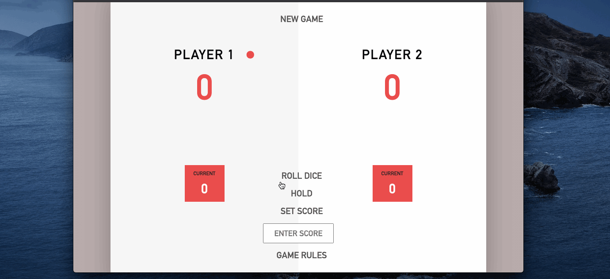

#   Two-Dice-Pig Game

## Challenges 
<ul>
<li>The manipulation of the DOM and the interaction between JavaScript and the webpage</li>
<li>The selection of webpage elements and the handle of DOM events</li>
<li>The challenges were confronted by playing different scenarios to understand the interaction between JavaScript, webpage elements, and DOM events; like adding the code in different places in the program to understand what works and what does not.</li>
</ul>

## Issues
<ul>
<li>The double rolled point does not add the total points, it only adds the last rolled of points to the score.</li>
</ul>

## Features added to the game
<ul>
<li>Disabled the hold and setScore buttons while the user is playing.</li>
<li>The user do not need to press the hold button every time. The program will automatically make the next player's turn.</li>
<li>A counting of each player wins will be added to the UI after the first win.</li>
<li>Responsive website.</li>
</ul>

## Play the Game
<h2><li><a href="https://game-1.vercel.app/" target="_blank"> Play the Game Here</a></li></h2>

---

---

